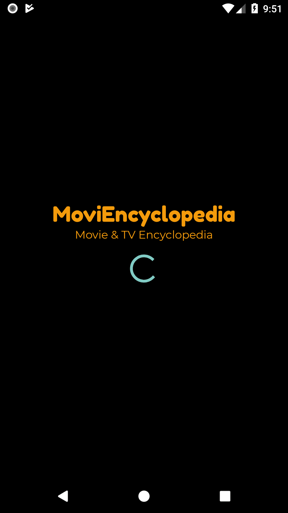
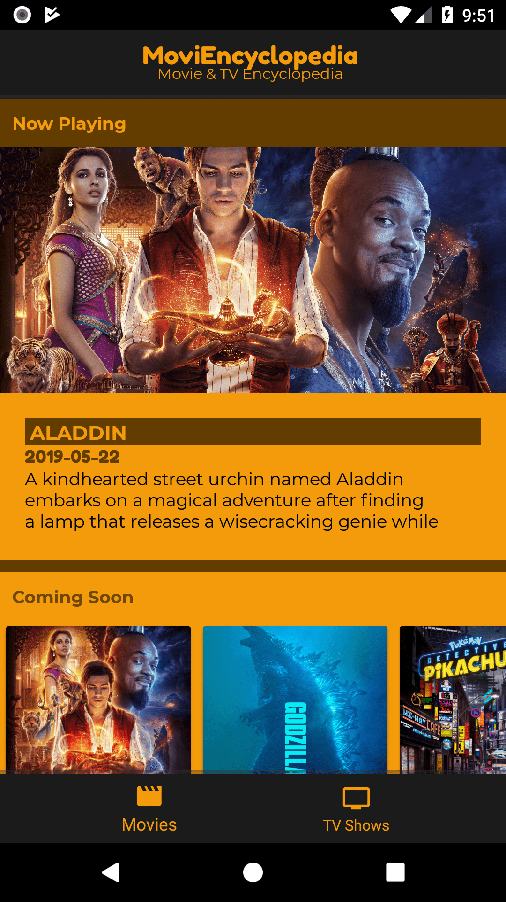
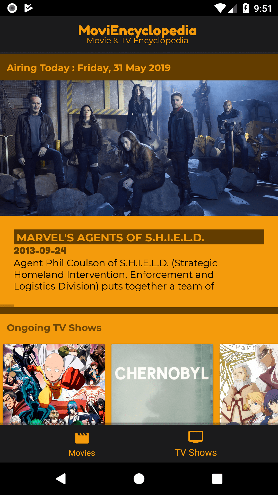

# **MoviEncyclopedia**

This Android mobile apps is a test based on **smartfrendigital** 

**Github** : https://github.com/smartfrendigital/mobile-test

The purposes of test is creating application that can present at-least 4 of the following lists based on API document: https://www.themoviedb.org/documentation/api

# Lists
- **Top rated movies** 
  - https://developers.themoviedb.org/3/movies/get-now-playing
- **Upcoming movies**
  - https://developers.themoviedb.org/3/movies/get-now-playing
- **Now playing movies**   
  - https://developers.themoviedb.org/3/movies/get-now-playing
- **Popular movies** 
  - https://developers.themoviedb.org/3/movies/popular
- **Popular TV shows** 
  - https://developers.themoviedb.org/3/tv/popular
- **Top rated TV shows** 
  - https://developers.themoviedb.org/3/tv/top_rated
- **On the air TV shows** 
  - https://developers.themoviedb.org/3/tv/on_the_air
- **Airing today TV shows** 
  - https://developers.themoviedb.org/3/tv/airing_today
- **Popular people** 
  - https://developers.themoviedb.org/3/people/get-popular-people

# Technical
For this cases I'm using widget:

- **NestedScrollView**
- **ConstraintLayout**
- **LinearLayout**
- **ProgressBar**
- **RelativeLayout**
- **Toolbar**
- **TextView**
- **RecyclerView**
- **CardView**
- **BottomNavigation**

And other third party library:
- **Volley** (For Android API Request)

# Import & Build
First you must `git pull` this repository then:

- Open your Android Studio and if any project is opened just close it (**Go to File->Close Project)** then you'll see a small window like this :
  
  
- Click on **Import Project(Gradle, Eclipse ADT etc)**, then you’ll get a dialog box like this :
  
  

- Here, browse your project by navigating the location where you kept your project, your project’s folder will appear with an Android logo on it like this :
  
  

- Select the app and click OK, this will take some time for the Gradle to build, wait for the loading time. (You might get error here stating the different SDK location, the error looks like this ):
  
  

- In case of the above error just go to Project Directory and you’ll then find the file named **“local.properties”** in the root folder of your project. Open this file and scroll to the last 2 lines **“ndk”** and **“sdk”** and change the location with the one of your SDK and save the file.
Again open the project or else if already opened in Android studio go to **Gradle->Rebuild**.
You have now successfully imported the project in Android Studio.

- Then you can **(Run -> Run App)**

# Screenshot

